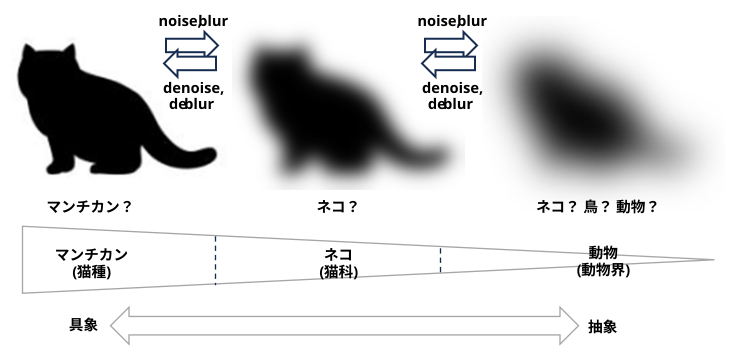
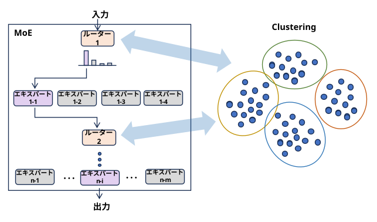
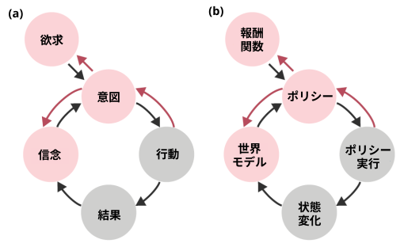

<html lang="ja">
    <head>
        <meta charset="utf-8" />
    </head>
    <body>
        <h1>
何となく似ている・・・
</h1>
        <h2>なにものか？</h2>
        

本質的に同じ、似ている、何となく似ている、・・・　いろいろあるが、似ているものを集める。
        

(例)
<h4>・<a href="https://boyoyon.github.io/Somewhat_Similar/data/diffusion_model_concept_formation.html">拡散モデルと概念形成</a></h4>

<h4>・<a href="https://boyoyon.github.io/Somewhat_Similar/data/moe_router_clustering.html">クラスタリングと MoE のルーティング</a></h4>

　MoE:　グループで挑戦するクイズ番組に参加するグループ 
　エキスパート：　グループのメンバー (得意な分野が異なる) 
　ルーター：　問題ごとに回答するメンバーを選ぶ人 
　　　　　　　→ 問題をクラスタリングする

<h4>・　<a href="https://boyoyon.github.io/Somewhat_Similar/data/irl_tom.html">逆強化学習と心の理論</a></h4>

<h3>あ</h3>

　アンシャープマスクとRetinex 
　・ ぼかして引くところが似ているだけ・・・

　<a href="https://boyoyon.github.io/Somewhat_Similar/data/moe_router_policy.html">MoEルーターと強化学習エージェントのポリシー</a>

<h3>か</h3>

　<a href="https://boyoyon.github.io/Somewhat_Similar/data/diffusion_model_concept_formation.html">拡散モデルと概念形成</a>

　<a href="https://boyoyon.github.io/Somewhat_Similar/data/irl_tom.html">逆強化学習と心の理論</a>

　<a href="https://boyoyon.github.io/Somewhat_Similar/data/moe_router_clustering.html">クラスタリングと MoE のルーティング</a>

　言語モデルと(強化学習)エージェント

　言語モデルと報酬モデル

<h3>さ</h3>

　<a href="https://boyoyon.github.io/Somewhat_Similar/data/resnet_ode.html">残差ネットワークと微分方程式</a>

<h3>た</h3>

　畳み込みと相関

　TD学習と脳内ドーパミン放出

　DNN と 繰りこみ群

<h3>な</h3>

　Non-Local Means と Self-Attention

<h3>は</h3>

　PINNs と知識蒸留 
　・物理損失を教師モデルとみなすと似ている気がする・・・

<h3>ま</h3>
<h3>や</h3>
<h3>ら</h3>
<h3>わ</h3>
</body>
</html>
